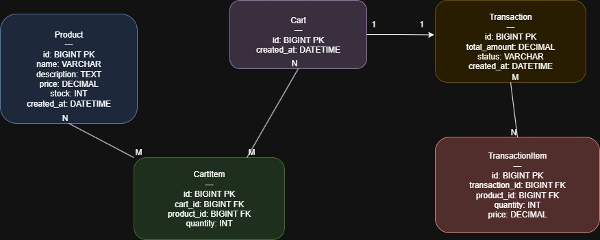

## Knowledge Base
1. Apa yang anda ketahui tentang Rest API?

- Interface yang memungkinkan komunikasi antara back end dengan front end dengan metode GET, POST, PUT, DELETE

2. Apa yang anda ketahui tentang Server side and Client side processing?

- Server : Proses yang dilakukan oleh server seperti memvalidasi data dan mengquery database
- Client : Proses yang dilakukan di web browser seperti penyesuaian UI dan validasi input

3. Apa yang anda ketahui tentang Monolith dan Microservices, berikan contohnya?

- Monolith : Menaruh semua fitur dalam 1 aplikasi, biasanya digunakan oleh aplikasi berskala kecil maupun E-Commerce lama
- Microservices : Aplikasi yang dibagi menjadi layanan independen contohnya Amazon

4. Apa yang anda ketahui tentang Design pattern inversion of Control serta Dependency Injection?

- Pola desain untuk mengurangi keterikatan antar komponen sehingga keterikatan tidak dibuat oleh Object melainkan disuntuk di Spring Boot menggunakan @Autowired

5. Apa yang anda ketahui tentang Java programming dan Spring framework khususnya spring-boot?

- Java : Bahasa pemograman OOP (Object Oriented Programming)
- Spring Boot : Framework untuk membangun aplikasi dengan bahasa Java yang menyediakan konfigurasi otomatis, REST API, serta integrasi database

## Desain Module

1. Desain Database
   
2. Desain Module

- ProductModule – Mengelola produk (CRUD, stok, harga).
- CartModule – Mengelola cart dan cartItem.
- TransactionModule – Checkout, transaksi, update status.
- UserModule  – login dan register.
3. Alasan menggunakan Monolith
- Pertama kali menggunakan Springboot sehingga mencari tau dan monolith lebih sedehana
- Mudah di deploy - Hanya satu artifact (jar) yang dijalankan
- Integrasi antar modulnya mudah
- Database tunggal sehingga menghindari masalah sinkronisasi antar services